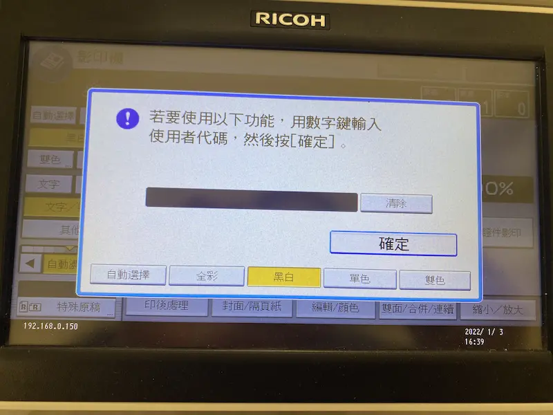
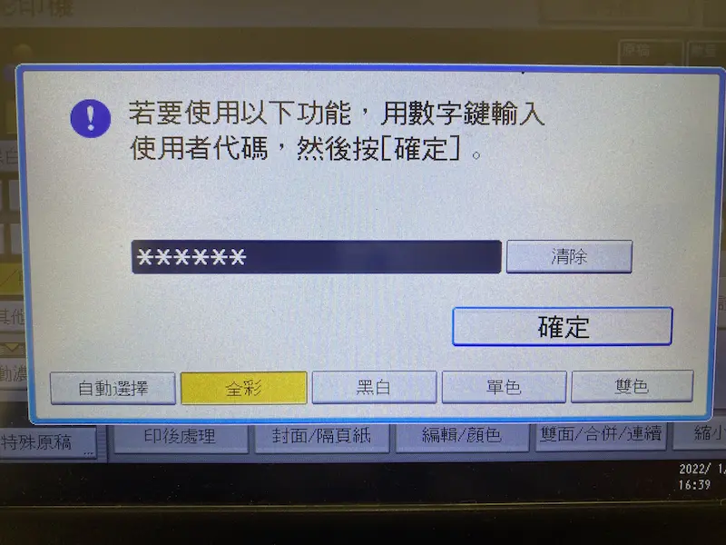
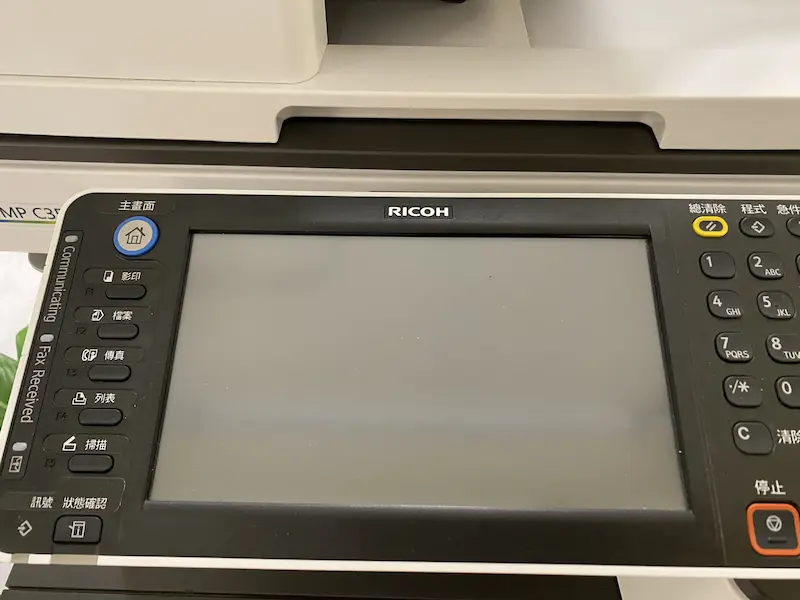
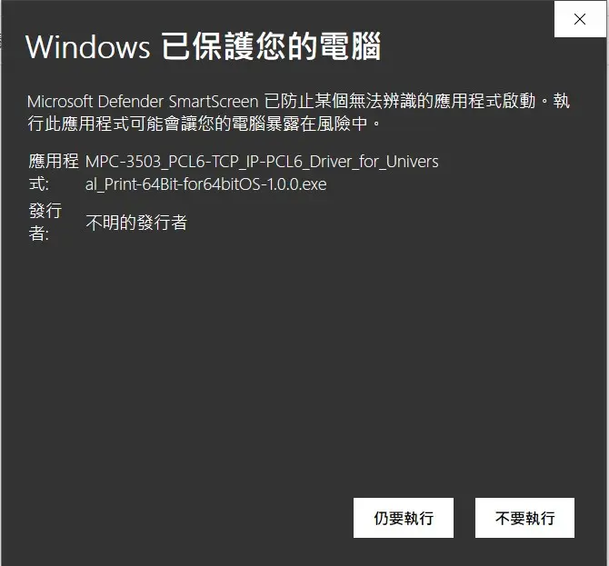
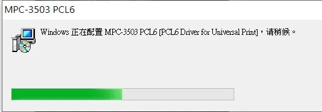
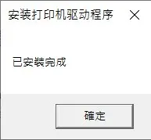
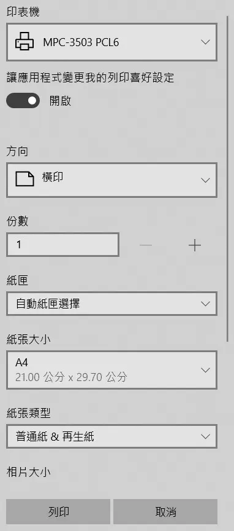
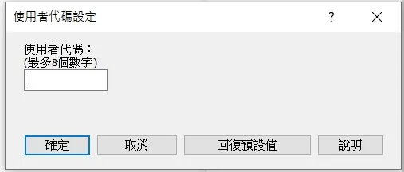

# 04. 事務機使用說明

### **【租⽤即視為明⽩並願意遵守空間使用手冊】**

### <mark style="color:blue;">**儲值使用會員**</mark>

單次影印:\
A4黑白: 每頁**3**元\
A4彩色: 每頁**8**元\
A3黑白: 每頁**4**元\
A3彩色: 每頁**15**元\
傳真: 每頁**15**元\
儲值使用: \
A4黑白: 250元/100張(**2.5元**/張)**、**&#x31;000元/500張(**2元**/張)\
A4彩色: 700元/100張(**7元**/張)\
A3黑白: 350元/100張(**3.5元**/張)**、**&#x31;500元/500張(**3元**/張)\
A3彩色: 1300元/100張(**13元**/張)

### <mark style="color:blue;">付款方式</mark>

1. **現金**
2. **匯款及轉帳資訊：彰化銀行 009 北屯分行** \
   **帳號：40280101788900** \
   **戶名：毅達投資有限公司**
3. **Line Pay：**[https://reurl.cc/pxkyXd](https://reurl.cc/pxkyXd)
4. **綠界一次扣款：**[https://p.ecpay.com.tw/A1B8D78](https://p.ecpay.com.tw/A1B8D78)\
   **綠界定期定額扣款：**[https://p.ecpay.com.tw/6432A19](https://p.ecpay.com.tw/6432A19)

### <mark style="color:blue;">**選擇列印的使用方式**</mark>

[<mark style="color:blue;">1. 操作事務機影印</mark>](04.-shi-wu-ji-shi-yong-shuo-ming.md#cao-zuo-shi-wu-ji-ying-yin)

[<mark style="color:blue;">2. 雲端列印使用方式(Windows)</mark>](04.-shi-wu-ji-shi-yong-shuo-ming.md#yun-duan-lie-yin-shi-yong-fang-shi-windows)

### <mark style="color:blue;">**操作事務機影印**</mark>

1\. 點擊「**節電**」呼叫主畫面

2\. 點擊「**節電**」呼叫主畫面並選擇「**影印機**」

3\. 輸入使用者代碼，即儲值會員所設定之密碼，輸入後即可列印。

4\. 如要列印彩色文件，需注意於下方列表有選擇「**全彩**」

5\. 使用結束後須再次點擊「**節電**」，關閉使用，否則下一位使用者會延續上一位使用者之帳號額度

6\. 確認畫面已關閉(完成)

### <mark style="color:blue;">**雲端列印使用方式(Windows)**</mark>

1\. 連接至「WensCo 文心會議室」無線網路

2\. 下載驅動程式

[點擊查看文件](https://drive.google.com/file/d/1mRb5VoVy8b7y6P0Mk0-7yBPZ0XYUpwYR/view?usp=sharing)
此為RICOH理光MPC 3503 彩色多功能事務機驅動程式

3\. 執行檔案，選擇「仍要執行」

4\. 等待安裝完成

5\. 驅動程式安裝完成

6\. 選擇想列印的檔案並選擇列印裝置為「MPC-3503 PCL6」，點擊「列印」**。**

7\. 輸入使用者代碼，即儲值會員所設定之密碼，輸入後即可列印。

