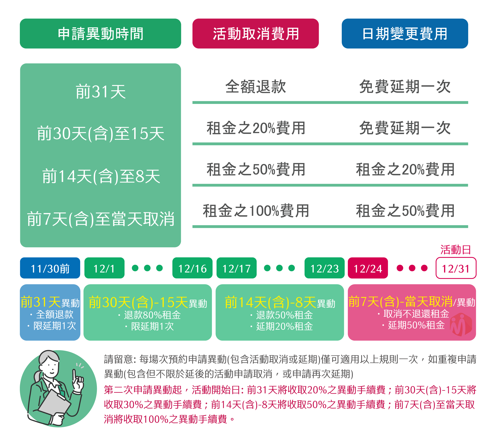

# 01. 場地使用規約

### **【租⽤即視為明⽩並願意遵守空間使用手冊】**

### <mark style="color:blue;">營業時間</mark>

空間可預約時間：8:00\~21:30

工作人員可服務時段：平日 8:00-18:00及例假日 8:00-18:00

※18:00過後，LINE@客服也會回訊息提供協助，如有其他需求，將於次一營業日進行回覆。

※農曆年節需來電確認是否場地可預約，依工作人員報價後始可付款使用。

### <mark style="color:blue;">館內注意事項</mark> 

1. 吸菸：**空間全面禁菸**，如有需要請至戶外，如管理人員發現違規，將向承租客戶**收取1000元作大樓環境維護基金。**
2. 是否可以烹飪：原則上禁止，特定活動可先提出申請，經核准可進行。
3. 包裹事先寄放：僅限自行搬入及宅配。\
   地址為：台中市北屯區文心路四段936-1號2樓\_文心會議室收。
4. 告示板以及海報張貼：館内海報張貼皆以所租借會議室為使用範圍進行張貼，並使用紙膠帶或黏土進行張貼，如對空間材質造成毀損將依照修復金額請求賠償。
5. 房間隔音問題：空間有進行個別隔音施工，為防止其他空間使用者之權利，請務必控制活動之音量，如有必要，得請客戶降低音量或離場。
6. 上鎖：如有隱私問題，可自行張貼不透明材質進行處理，所有空間不得鎖上。
7. 展售使用：公共空間可彈性提供商品展售空間，如有需要須提前向工作人員洽詢。

### <mark style="color:blue;">場地使用規約</mark> 

1. ⼤樓出入與搭乘電梯，須遵守大樓規範，公共區域應保持輕聲細語，請勿大聲喧嘩。
2. 場地開放時間為預訂使用時間之前30分鐘，預定使用時間包含前場佈及後場復。
3. 活動期間，請⼈員注意隨⾝個⼈貴重物品，**WensCo** 無法負擔保管責任。
4. 本會議中心配合商業大樓上下班時間，晚上11點後將閉館，恕無法提供租借場地。&#x20;
5. 如承租⼈或參加活動⼈員造成場地或設備毀損，**承租⼈須負賠償責任**。
6. 活動結束後，空間提供⼤型垃圾袋，垃圾請確實分類丟棄，若場地未完成清潔復原，每次得向承租⼈加收**清潔服務費500元起（含稅）**。
7. 會議空間有提供場地平⾯圖、WiFi無線網路、投影設備與⼿持無線麥克風（2組）、飲水機茶⽔，展架物品可提前寄放，桌椅採⾃助式或預約員工擺設。
8. 預約於全額付款後始⽣效，匯款銀⾏： 彰化銀行009，匯款帳號：4028-01-017889-00，⼾名：毅達投資有限公司。發票於活動當⽇交付，如須抬頭、統編與提前開立或郵寄請提早告知。
9. 取消預約或修改日期: \
   1\. 活動開始前31天取消，租金全退; 異動限免費延期一次\
   2\. 活動開始前30天至15天內取消，收取租金之20%費用; 異動限免費延期一次\
   3\. 活動開始前14天至8天內取消，收取租金之50%費用; 異動收取租金之20%費用\
   4\. 活動開始前7天至當天取消，不退還租金; 異動收取租金之50%費用

* 如**同一預約重複申請異動**，第二次申請異動起，將依圖表規定收取異動手續費。

<figure><figcaption></figcaption></figure>

1. 場地已依台中市政府規範向第一產物保線投保公共意外責任險。
2. 活動參加者參與活動即被視為明⽩並願意遵守所有 **WensCo** 場地使⽤規範。**WensCo** 有權隨時更改條款及細則⽽毋須另⾏通知，⽽該更改亦適⽤於未來或現有的參加者。
3. **WensCo** 保留修改、變更或暫停場地使用規範之權利，如有爭議，均依 **WensCo** 相關規定辦理，並可予隨時補充。
