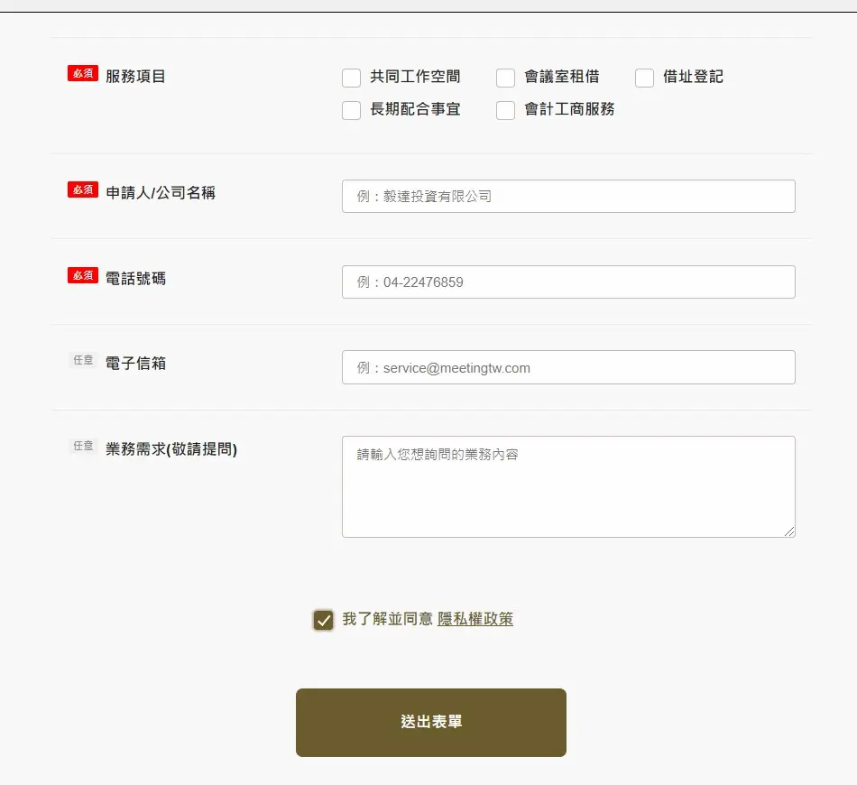
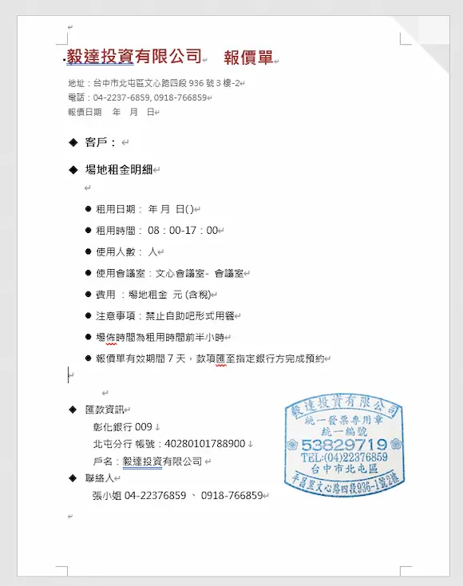

# 02. 場地預約與規範

### **【租⽤即視為明⽩並願意遵守空間使用手冊】**

### <mark style="color:blue;">**營業時間與預訂受理開始時間**</mark> 

1. 空間可預約時間：8:00\~21:30，分為上午(8:00-12:00)、下午(13:00-17:00)、晚上(18:00-21:30)三個時段。
2. 本公司服務時段：平日 8:00-18:00及例假日 8:00-18:00，使用場地之客戶不受此限，各時段皆有人員服務。
3. 每日18:00過後，將轉由LINE@客服提供訊息協助，如有預約需求，最晚將於次一營業日進行回覆。
4. 本設施全年無休，但因不可抗力之因素影響(如: 颱風)以及設施設備檢查等原因，可能會臨時休館。
5. 本公司每年元月1月1日起即開始接受次年度的預訂。
6. 文心館配合商業大樓開放時間，場地須於晚上10:30離場，並配合大樓安全管制時間。

### <mark style="color:blue;">**檔期預約規範**</mark> 

1. 如有年度計畫需定期租借場地，歡迎與工作人員洽談，場地預約需依規定辦理並可提供消防安檢證明與場地保險證明。
2. 自2023年7月起，為提升假日場地租用效率，以下規則將適用於大會議室（302大會議室、306大會議室、402大會議室）：
   1. 假日時段如僅預約單一時段（例如：週六上午或週日晚上），恕無法受理定期租用。&#x20;
   2. 如大會議室活動日距預約日期不足一個月，檔期預約則不受上述限制。

### <mark style="color:blue;">**預約方式**</mark> 

請在[<mark style="color:blue;">**官網填寫聯絡表單**</mark>](https://meetingtw.com/contact-us)**，**&#x5DE5;作人員確認內容後會主動聯繫您，後續如檔期允許會傳送正式報價單，在完成付款程序後即算完成場地預約。

### 分頁1. 填寫聯絡表單
依照需求填寫聯絡表單，<mark style="color:blue;">勾選我了解並同意隱私政策</mark>後，並送出表單。

### 分頁2. 接收確認信件
請確認是否收到來自<mark style="color:blue;">service@meetingtw.com</mark>之信件，若沒有收到信件，可檢查是否在垃圾信件或直接[聯繫我們](line://ti/p/@lau9039l)

### 分頁3. 取得報價單進行匯款
依照匯款資訊於報價單<mark style="color:blue;">有效期間</mark>內完成款項匯款，可告知工作人員，進行後續確認。

### 分頁4. 完成預約
完成預約囉！如有任何需求可以聯絡工作人員，退款政策問題[<mark style="color:blue;">點此查看</mark>](https://guide.meetingtw.com/space-guide/03.-chang-di-fu-kuan-fang-shi#h.p_vddnkcpqohva-1)。

