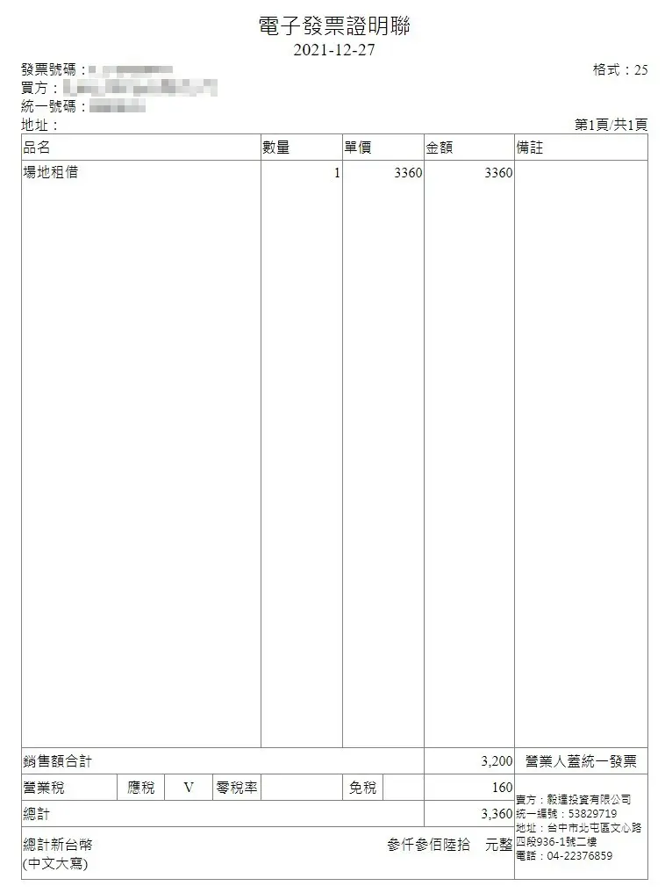

# 03. 場地付款方式

### **【租⽤即視為明⽩並願意遵守空間使用手冊】**

### <mark style="color:blue;">付款方式</mark> 

我們最晚會於<mark style="color:blue;">**2**</mark>個工作天內提供報價單，並提供現金、**匯款**、**轉帳**、**Line Pay電子支付**、**綠界信用卡一次付清**、**分期付款(限營業登記及工作空間)付款方式。**

1. **匯款及轉帳資訊：彰化銀行 009 北屯分行** \
   **帳號：40280101788900** \
   **戶名：毅達投資有限公司**
2. **Line Pay：**[https://reurl.cc/pxkyXd](https://reurl.cc/pxkyXd)
3. **綠界一次扣款：**[https://p.ecpay.com.tw/A1B8D78](https://p.ecpay.com.tw/A1B8D78)\
   **綠界定期定額扣款：**[https://p.ecpay.com.tw/6432A19](https://p.ecpay.com.tw/6432A19)

### <mark style="color:blue;">**發票開立**</mark>

我們提供A4電子發證明聯(如下圖所示)，如需要選擇開立日期，請務必提前聯繫工作人員。

