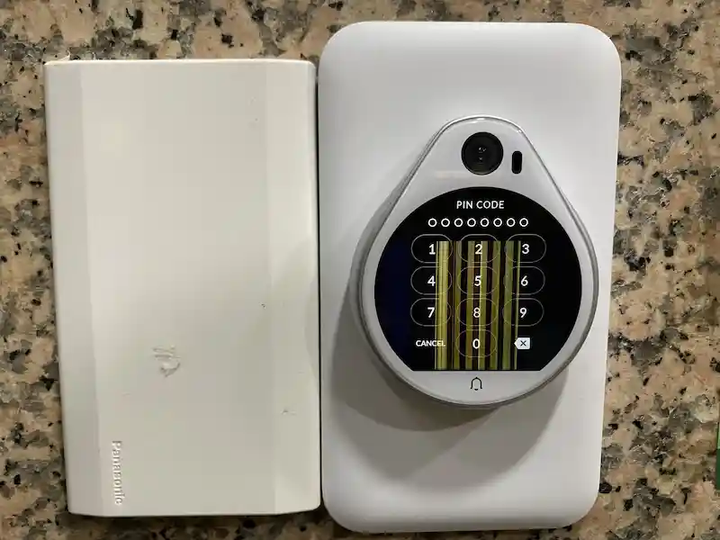
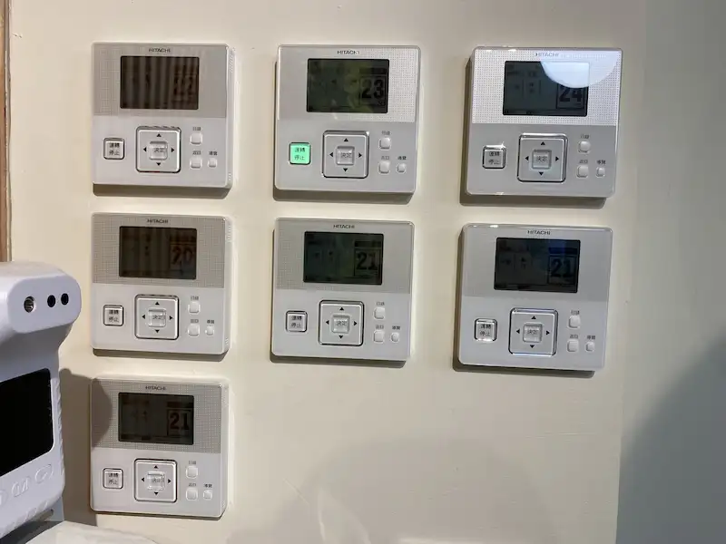
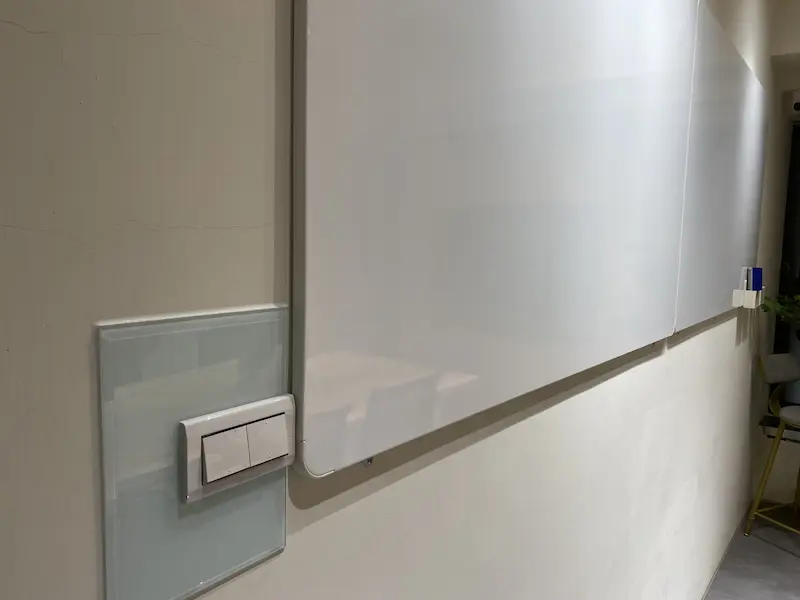
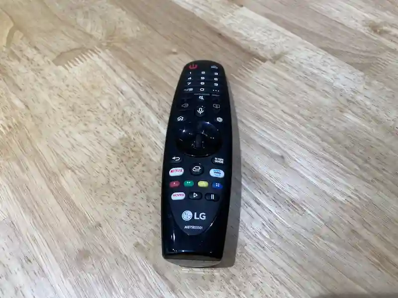
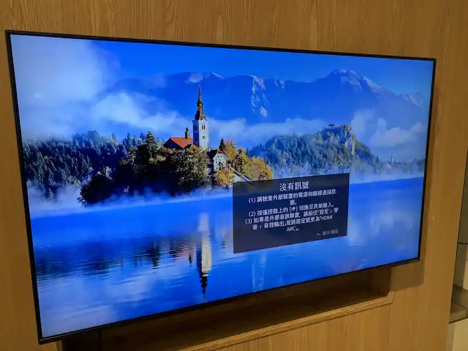
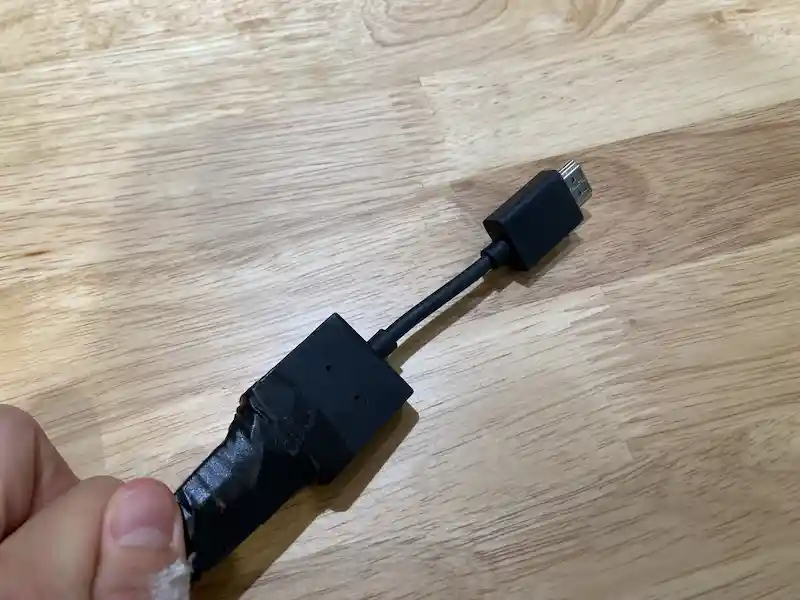
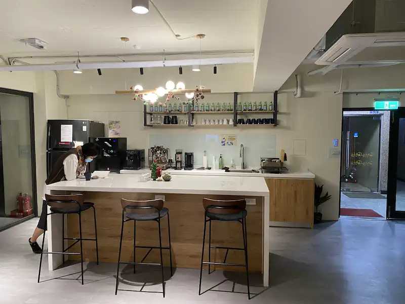

# 08. 305討論室自助使用流程

### <mark style="color:blue;">自助進場流程</mark>

1\. 由工作人員私訊密碼(8碼)，輸入後即可進入

2\. 於櫃檯左側有空調之控制面板，開啟如圖中上方305之空調

3\. 進入空間後，開啟燈源

4\. 如需投影，可自行開啟電視

5\. 投影接口為hdmi線，筆電插入後需抓取訊號

6\. 公共區域目前僅開放使用冰箱、飲水機，其他電器設備暫無開放自助使用。

7\. 使用完畢後，請確實將**電源**以及**空調**關閉，環境需保持乾淨、垃圾依分類標示處理，如有任何問題歡迎隨時[聯繫客服](line://ti/p/@meetingtw)或來信至[service@meetingtw.com](mailto:service@meetingtw.com)
